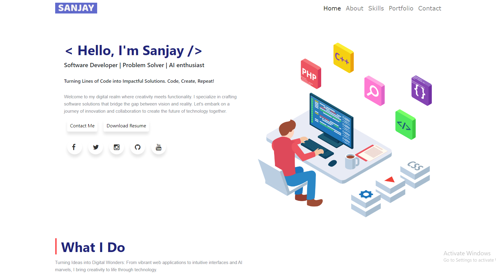

# MyAngular

    
# Software Developer Portfolio

Welcome to my Software Developer Portfolio! This site serves as a showcase of my journey, skills, and accomplishments as a software developer. Here, you'll find a collection of important tools, notable projects, insights into my background, skills, and ways to get in touch with me.

## Key Features

- **Projects Showcase:** Explore a diverse range of projects I've worked on, each highlighting different aspects of my coding expertise. From web applications to mobile solutions, there's a variety to explore.

- **Highlighted Tools:** Discover the key tools and technologies that are an integral part of my development workflow. These tools play a crucial role in shaping the quality and efficiency of my work.

- **About Me:** Learn more about the developer behind the code. Dive into my background, interests, and the journey that led me to the world of software development.

- **Skills:** Get insights into the skills I've developed over the years. From programming languages to problem-solving, my skill set is tailored to create effective and elegant solutions.

- **Contact Information:** Interested in collaboration, job opportunities, or just want to say hello? Find all the ways to reach out to me in the Contact section.

## Getting Started

To explore my portfolio, simply visit [portfolio-url](#). There, you'll find detailed information about my projects, skills, and more. Feel free to reach out if you have any questions or if you're interested in connecting.

I'm excited to share my journey as a software developer with you. Explore, learn, and connect!
